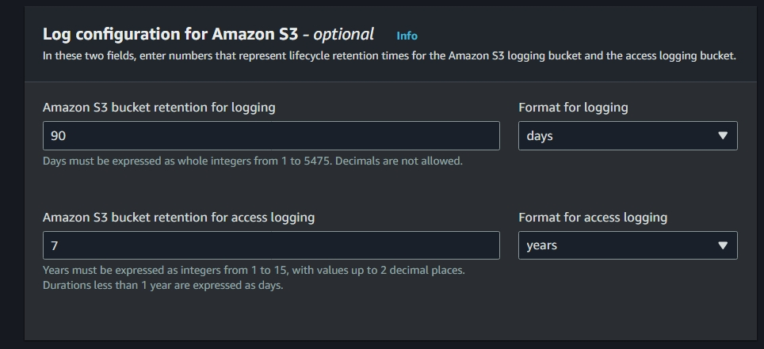
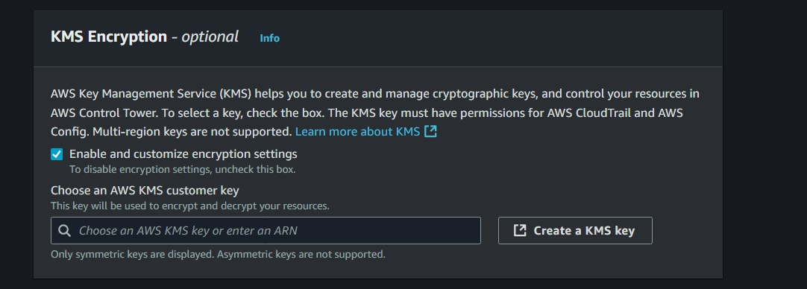
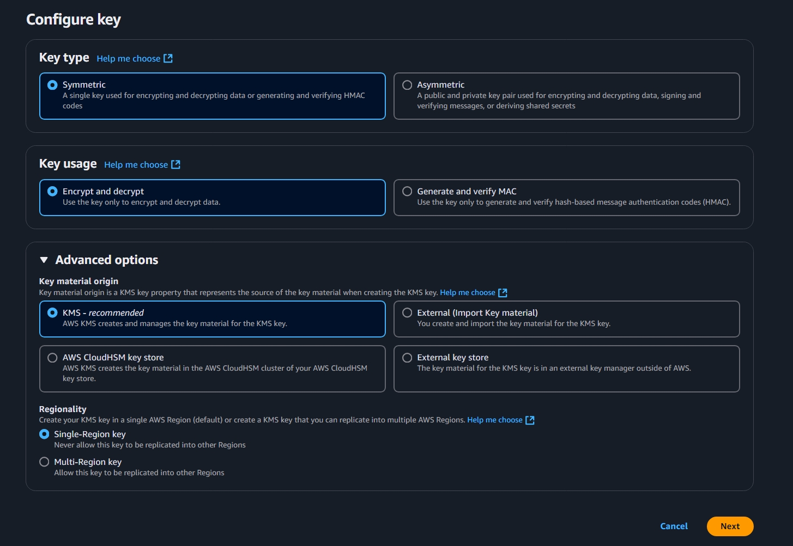
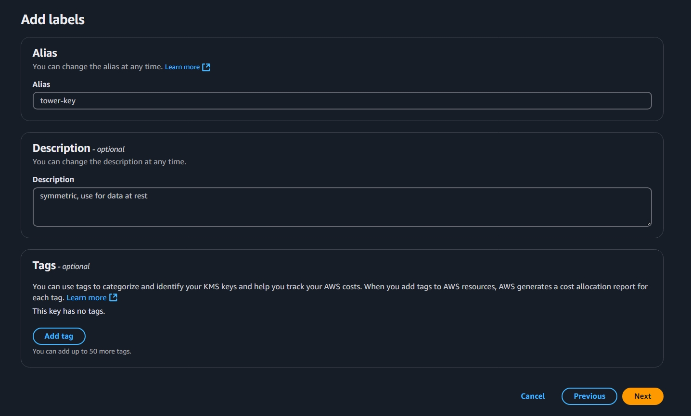
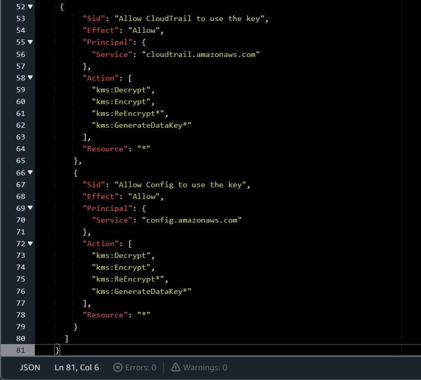
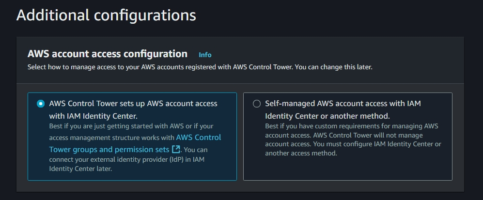
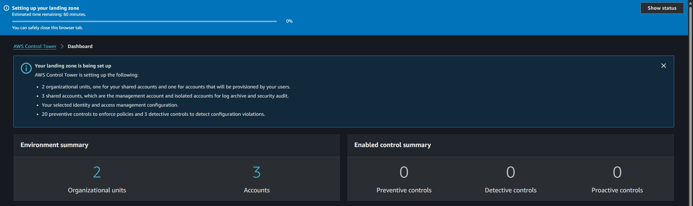

# Decide on encryption and storage capabilities
  
   
  
   
  
  

   
   

# Options to choose Identity and ensure logging
## - The cloudtrail required manual set up (as can be seen from the logging folder)

 .jpeg>)

 

# Accepted notifications for the Admin in regards to the environment 

 

# Users should folllow instructions from their email: Accept invitation and set up passwordless MFA 

 

 

 

 

# Then able to use Access Portal for login to accounts.

 

 

