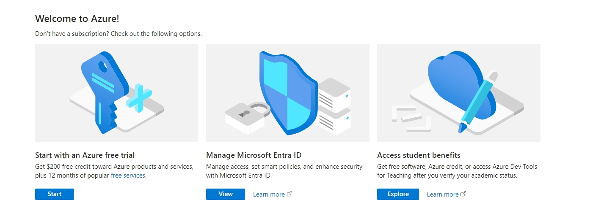
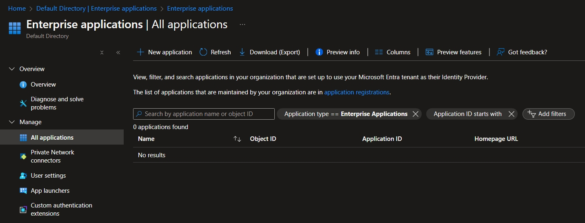
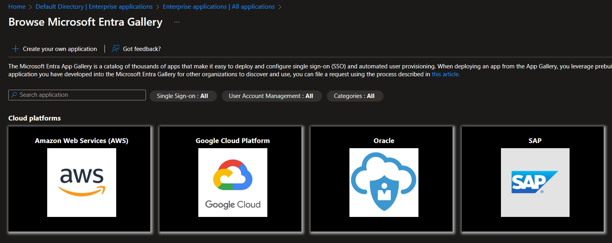
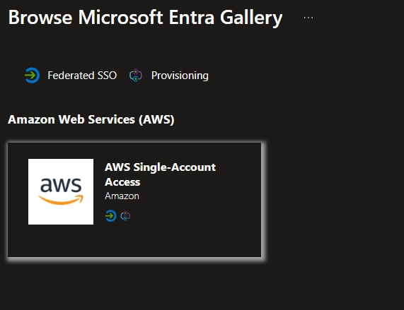
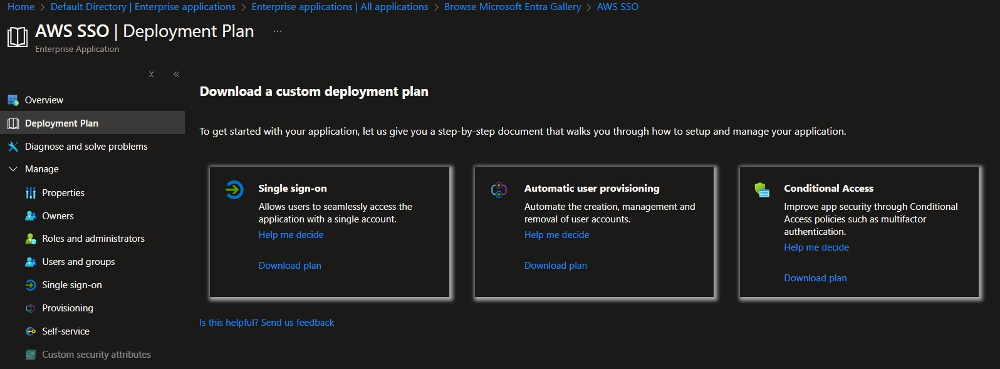
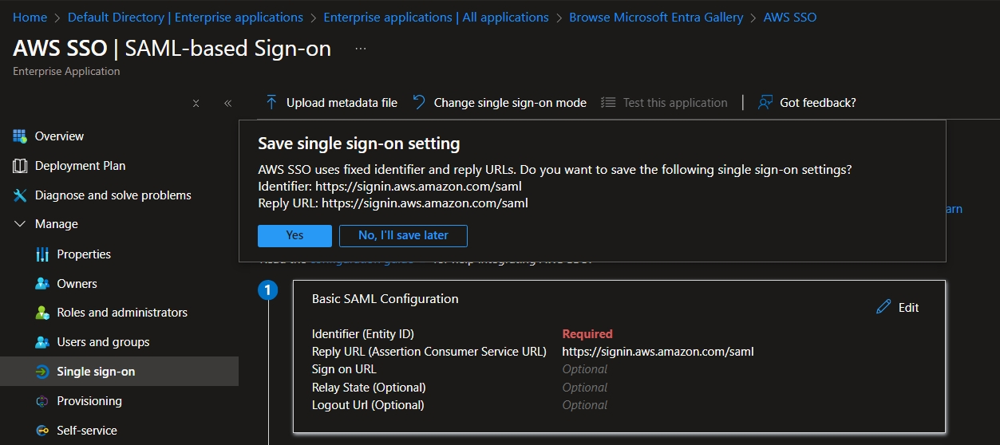
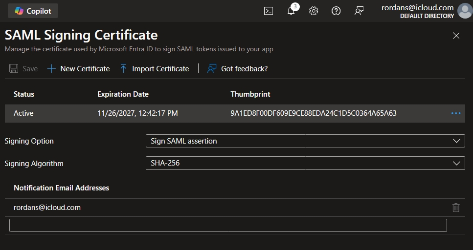
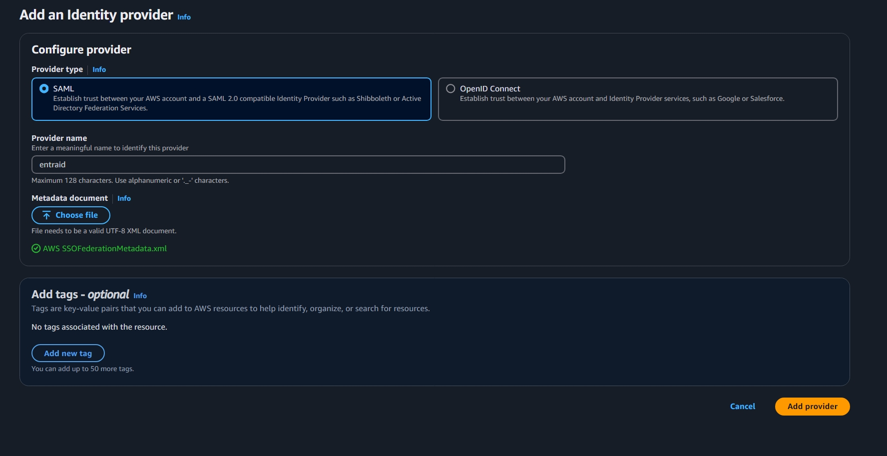
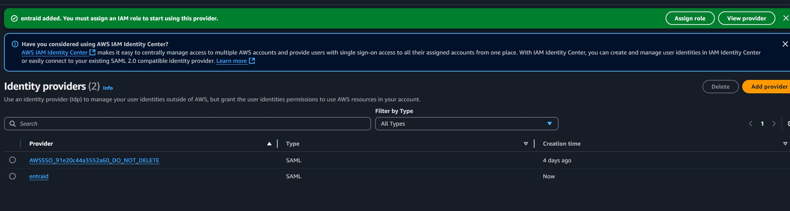
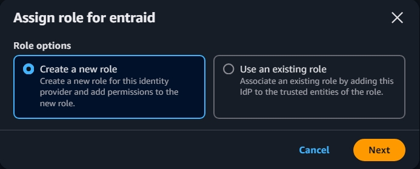

# Set up an enterprise application in the IdP (EntraID)

 

 

 

  

   

 

  

 
  # Uploaded the SAML metadata file in IAM Identity Center (AWS SSO service)
 
  
 
   

# Next steps would be to create a role for users to assume via the IdP

  

