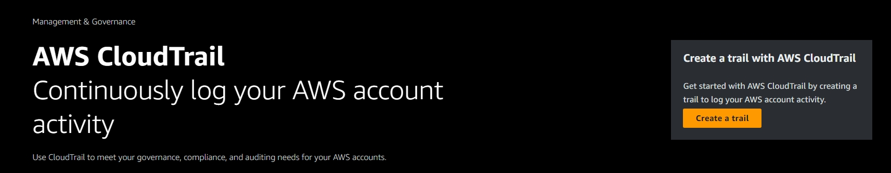
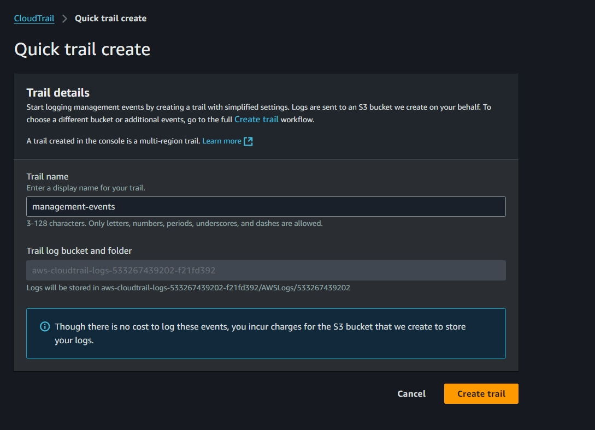
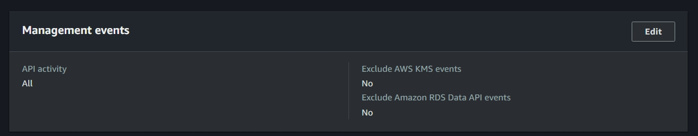
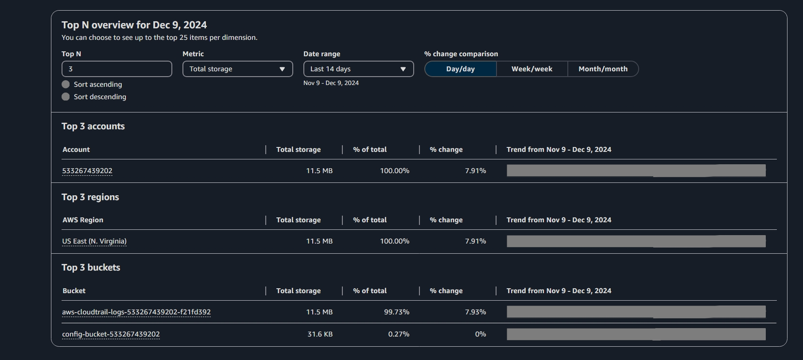
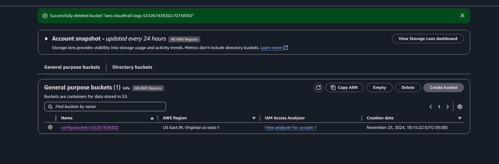
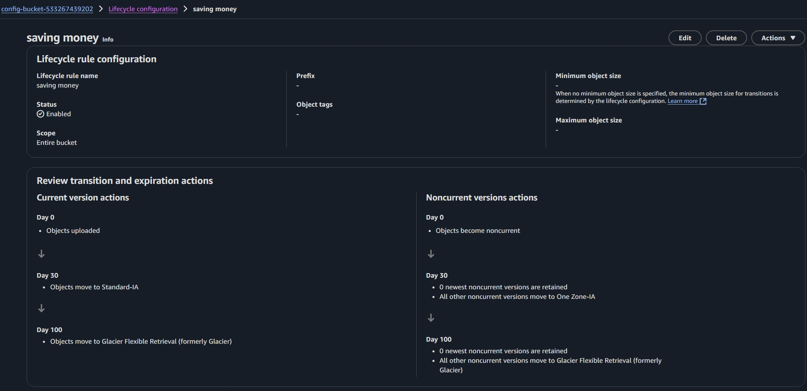

# Manually creating a trail due to autocreate implications

## Location and name

## Default settings are to log all API operations that read and modify resources

## Extra precaution is to use this custom SCP to prevent logging being turned off by non root users

## Can view the amount of bucket storage used

# Delete irrelevant logs or create lifecylce rules to save money

## Since this is a demo I can use the root account to delete the cloudtrail bucket destination which is consuming the majority of data

## It's also possible to create lifecycle policies which move older versions to cheaper less reliable storage after a specified amount of time, but are still availble if needed.

