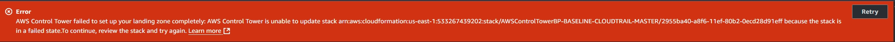
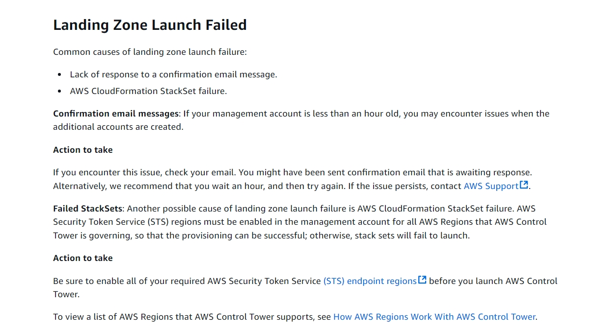
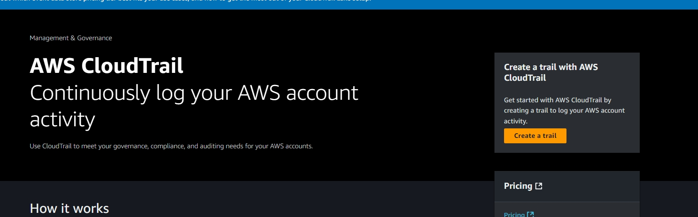
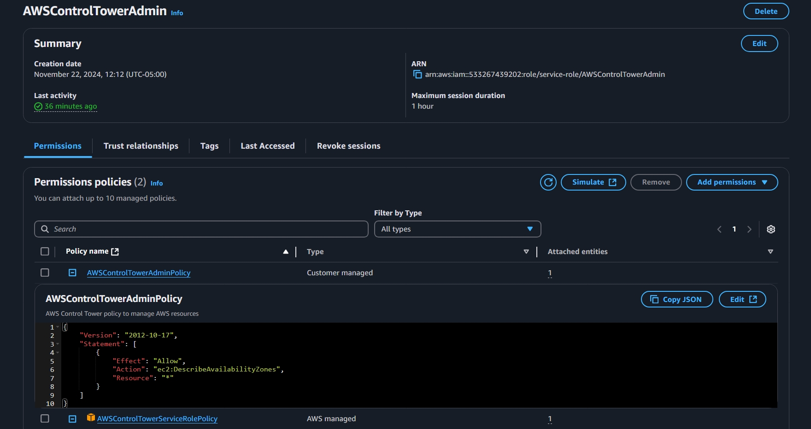

## Viewing Cloudformation error details

 

# Reccomended actions

 

## Checked endpoint permissions as suggested

 

## Issue rolling back stack due to cloudtrail deletion permissions, gave full access

 

 

## Redo Account creation via control tower

 

 

 

## Unable to write to S3, made sure the control tower roles were key adminstrators

 

 

## Says trail log failed to delete but there was nothing shown in service tab

 

## Checking permission policies

 

 

## Ended up creating a trail manually